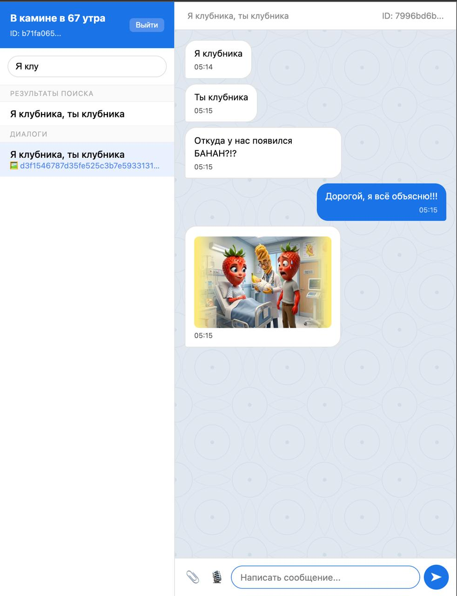

# Управление конфигурациями (Kustomize) и автоматизация (GitOps)

В данном разделе описаны различия между окружениями разработки и продакшна, а также приведена схема настройки непрерывного развертывания через Argo CD.

## 1. Разделение конфигураций через Kustomize
| Параметр | Оверлей `dev` | Оверлей `prod` |
| :--- | :--- | :--- |
| **Количество реплик приложений** | `1` для всех сервисов | `3` для обеспечения отказоустойчивости |
| **Количество реплик БД и S3** | `1` (Postgres, MinIO) | `1` (Масштабирование БД требует StatefulSet/кластеризации) |
| **Том для хранения файлов** | `emptyDir` (Локальная эмуляция без прав доступа) | `PersistentVolumeClaim` (Реальный S3 CSI драйвер) |

В оверлее `prod` масштабирование прикладного слоя до 3 реплик через декларативный блок `replicas` в `kustomization.yaml`, что предотвращает нежелательное масштабирование одиночных подов баз данных.

---

## 2. Автоматизация развертывания через Argo CD (GitOps)

Манифесты приложений Argo CD разделены на два файла для независимого управления средами.

### Файл `argocd/application-dev.yaml`
Смотрит на ветку `main` и путь `k8s/overlays/dev`. Предназначен для локального развертывания разработчиками.

### Файл `argocd/application-prod.yaml`
Смотрит на ветку `main` и путь `k8s/overlays/prod`. Используется для автоматического деплоя на продакшн-стенды.

В обеих средах настроена автоматическая синхронизация:
* `prune: true` — автоматически удаляет ресурсы из кластера, если они были удалены из репозитория GitHub.
* `selfHeal: true` — автоматически перезаписывает изменения в кластере, если кто-то попытался вручную отредактировать ресурсы в обход Git.

---

## 3. Результаты тестирования и скриншоты

### Argo CD (`Dev`)
 

### Интерфейс приложения и отправка сообщений
Приложение успешно запущено. Авторизация пользователей и отправка текстовых сообщений, а также файлов (картинок) работают без ошибок.

