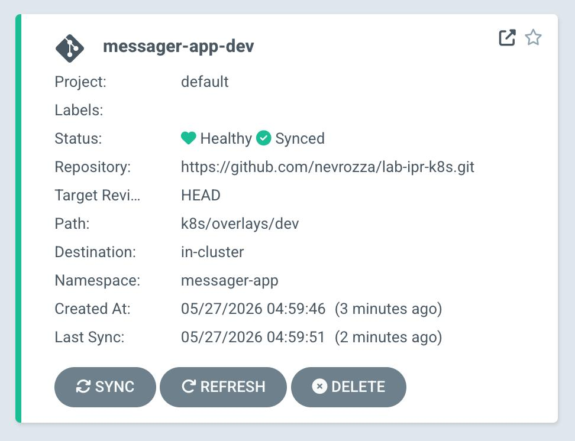
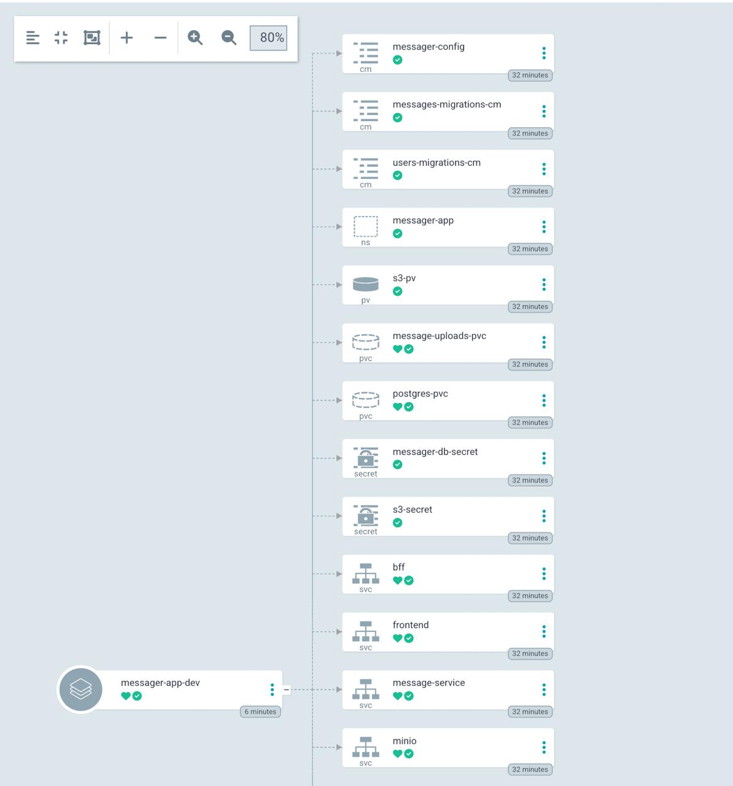
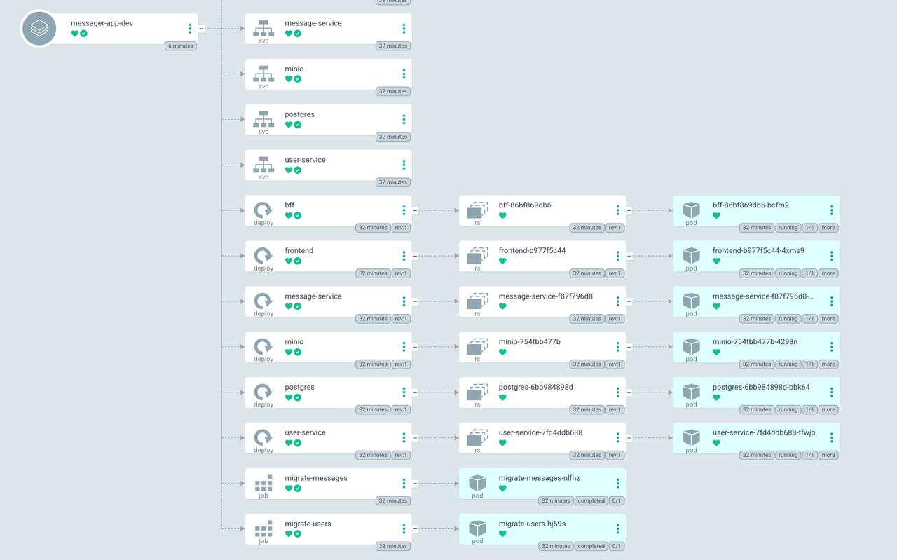
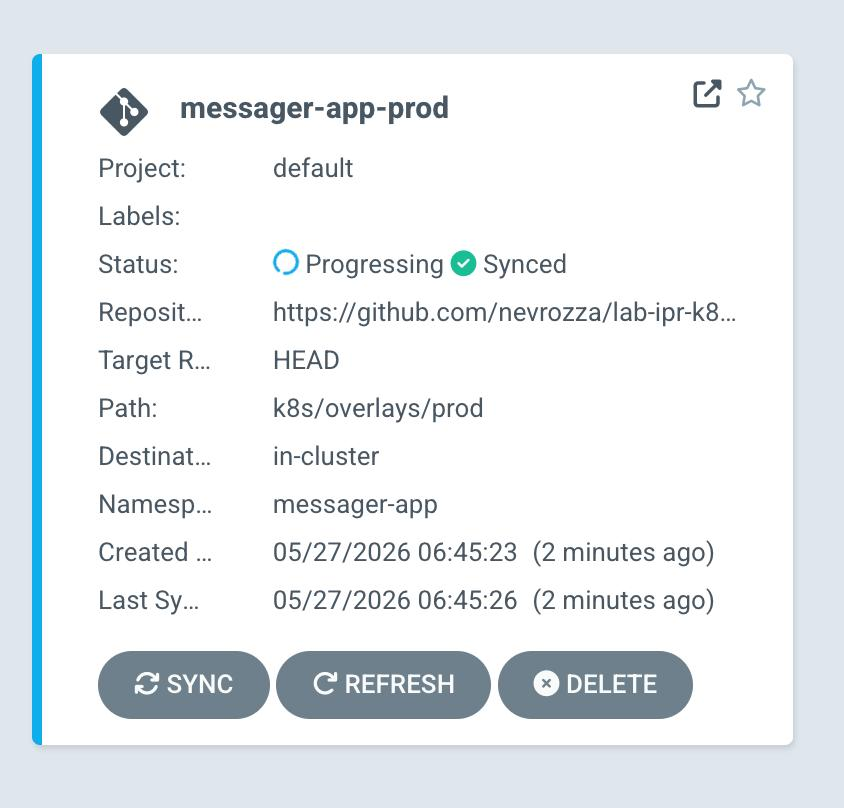
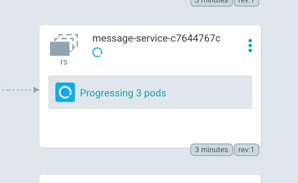

## Результаты и скриншоты

### Argo CD (`Dev`)

  

  
  

### Argo CD (`Local Prod`)

При попытке запустить прод локально всё заедат в ожидании монтирования диска – вся проблема в том, что локально нет доступа к s3 =(

  

  

### Интерфейс приложения и отправка сообщений
Приложение успешно запущено. Авторизация пользователей и отправка текстовых сообщений, а также файлов (картинок) работают без ошибок.

  

